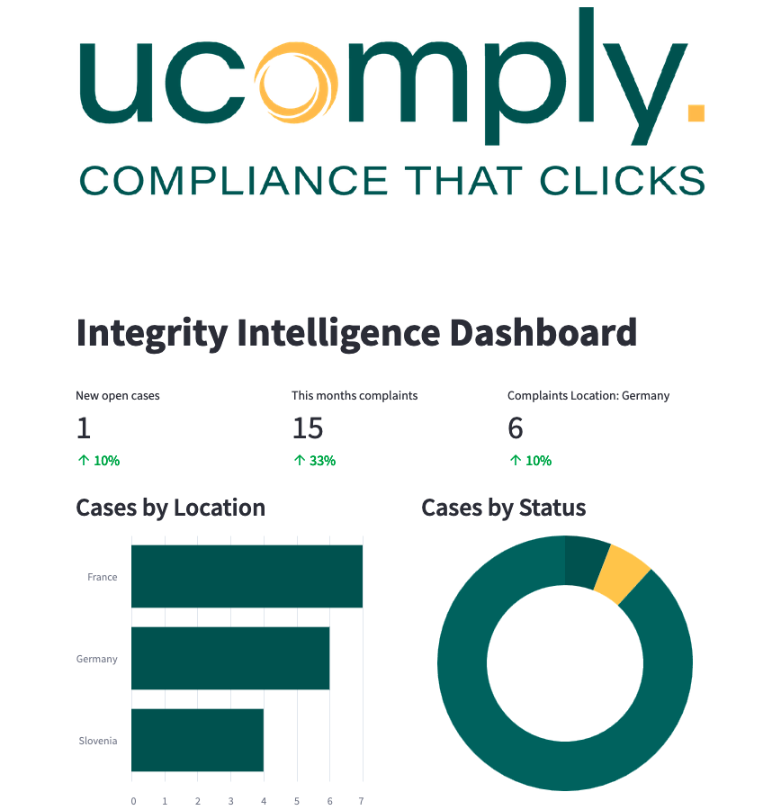
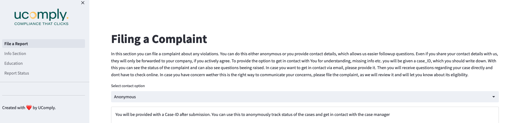

# 👋 U-Comply software

  


## Links to our Ucomply's Github Repo

[UComply on Github](https://github.com/noahbu/ucomply)

## Our goal

We automate your compliance & complaints handling needs!
Because your Compliance is what matters to us!

##See our product in action: 

### User-view: 

[](https://ucomply.streamlit.app/)

### Managing-view: 

[](https://ucomply-manager.streamlit.app/)

## Installation

### Getting started

```
# create conda environment
conda create -n ucomply python==3.11.4
conda activate ucomply
pip install requirements.txt
```
### Basics
```
#run the User-View
cd /frontend/user_view 
streamlit run File_a_report.py

#To run the admin view
cd /frontend/managing_view
streamlit run File_a_report.py
```
### Juicy Demo

Here's an image of the Dashboard view:  
  


  
 Here is an image of the File a Complaint Overview
 


## Technical Details
We built a Webapp on the [Streamlit](https://streamlit.io/) Framework. It provides a simple layout which we only had to adapt a little to our preferences. 
Streamlit is also very good for additional adding of ML-Models/Ai integration for the future. 

Our product actually consists of two Webapps: One for the user/employee filing a case and one for the manager/person to resolve and handle the case. 
Both are connected via a database containing all the complaints and a chat database for each case. 

### Folder Structure: 
- Each webapp has a subfolder in /frontend. In it is one launch file containing the landing page as well as other pages in the /pages folder.
- Databases and PDFs are stored in the /data folder.
- additional setup and design files are needed in various locations. 
